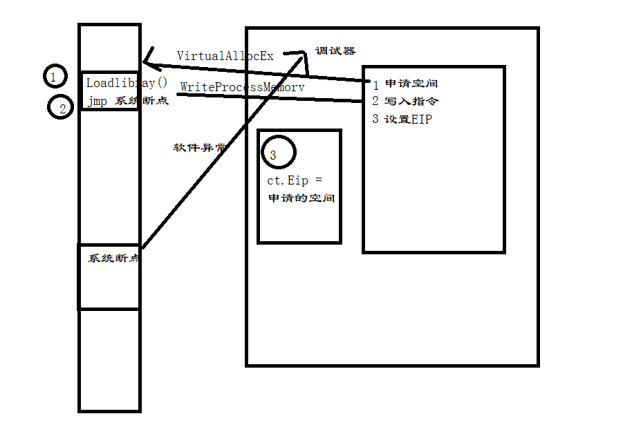

# 寄存器结构体

- regstruct.h

```cpp
#pragma once

typedef struct _EFLAGS
{
	unsigned CF : 1;       //进位或错位
	unsigned Reserve1 : 1;
	unsigned PF : 1;       //计算结果低位包含偶数个1时，此标志为1
	unsigned Reserve2 : 1;
	unsigned AF : 1;       //辅助进位标志，当位3处有进位或借位标志时该标志为1
	unsigned Reserve3 : 1;
	unsigned ZF : 1;       //计算结果为0时，此标志为1
	unsigned SF : 1;       //符号标志，计算结果为负时该标志为1
	unsigned TF : 1;       //陷阱标志，此标志为1时，CPU每次仅会执行1条命令
	unsigned IF : 1;       //中断标志，为0时禁止响应（屏蔽中断），为1时恢复
	unsigned DF : 1;       //方向标志
	unsigned OF : 1;       //溢出标志，计算结果超出机器所表达范围时为1,否则为0
	unsigned IOPL : 2;       //用于标明当前任务的I/O特权级
	unsigned NT : 1;       //任务嵌套标志
	unsigned Reserve4 : 1;
	unsigned RF : 1;       //调试异常相应控制标志位，为1禁止响应指令断点异常
	unsigned VM : 1;       //为1时启用虚拟8086模式
	unsigned AC : 1;       //内存对齐检查标志
	unsigned VIF : 1;       //虚拟中断标志
	unsigned VIP : 1;       //虚拟中断标志
	unsigned ID : 1;       //CPUID检查标志
	unsigned Reserve5 : 10;
}EFLAGS, *PEFLAGS;

//自己的数据结构保存你所有的断点信息。
typedef struct _DBG_REG6 {
	/*
	//     断点命中标志位，如果位于DR0~3的某个断点被命中，则进行异常处理前，对应
	// 的B0~3就会被置为1。
	*/
	unsigned B0 : 1;  // Dr0断点触发置位
	unsigned B1 : 1;  // Dr1断点触发置位
	unsigned B2 : 1;  // Dr2断点触发置位
	unsigned B3 : 1;  // Dr3断点触发置位
					  /*
					  // 保留字段
					  */
	unsigned Reserve1 : 9;
	/*
	// 其它状态字段
	*/
	unsigned BD : 1;  // 调制寄存器本身触发断点后，此位被置为1
	unsigned BS : 1;  // 单步异常被触发，需要与寄存器EFLAGS的TF联合使用
	unsigned BT : 1;  // 此位与TSS的T标志联合使用，用于接收CPU任务切换异常
					  /*
					  // 保留字段
					  */
	unsigned Reserve2 : 16;
}DBG_REG6, *PDBG_REG6;

typedef struct _DBG_REG7
{
	/*
	// 局部断点(L0~3)与全局断点(G0~3)的标记位
	*/
	unsigned L0 : 1;  // 对Dr0保存的地址启用 局部断点
	unsigned G0 : 1;  // 对Dr0保存的地址启用 全局断点
	unsigned L1 : 1;  // 对Dr1保存的地址启用 局部断点
	unsigned G1 : 1;  // 对Dr1保存的地址启用 全局断点
	unsigned L2 : 1;  // 对Dr2保存的地址启用 局部断点
	unsigned G2 : 1;  // 对Dr2保存的地址启用 全局断点
	unsigned L3 : 1;  // 对Dr3保存的地址启用 局部断点
	unsigned G3 : 1;  // 对Dr3保存的地址启用 全局断点
					  /*
					  // 【以弃用】用于降低CPU频率，以方便准确检测断点异常
					  */
	unsigned LE : 1;
	unsigned GE : 1;
	/*
	// 保留字段
	*/
	unsigned Reserve1 : 3;
	/*
	// 保护调试寄存器标志位，如果此位为1，则有指令修改条是寄存器时会触发异常
	*/
	unsigned GD : 1;
	/*
	// 保留字段
	*/
	unsigned Reserve2 : 2;
	/*
	保存Dr0~Dr3地址所指向位置的断点类型(RW0~3)与断点长度(LEN0~3)，状态描述如下：
	00：执行 01：写入  11：读写
	00：1字节 01：2字节  11：4字节
	*/
	unsigned RW0 : 2;  // 设定Dr0指向地址的断点类型 
	unsigned LEN0 : 2;  // 设定Dr0指向地址的断点长度
	unsigned RW1 : 2;  // 设定Dr1指向地址的断点类型
	unsigned LEN1 : 2;  // 设定Dr1指向地址的断点长度
	unsigned RW2 : 2;  // 设定Dr2指向地址的断点类型
	unsigned LEN2 : 2;  // 设定Dr2指向地址的断点长度
	unsigned RW3 : 2;  // 设定Dr3指向地址的断点类型
	unsigned LEN3 : 2;  // 设定Dr3指向地址的断点长度
}DBG_REG7, *PDBG_REG7;
```


## 汇编引擎使用

- keystone 

```cpp
//1. 包含头文件
#include "keystone/include/keystone.h"

//2. 包含静态库
#pragma comment (lib,"keystone_x86.lib")


// 打印opcode
void printOpcode(const unsigned char* pOpcode , int nSize)
{
	for(int i = 0; i < nSize ; ++i)
	{
		printf("%02X " , pOpcode[ i ]);
	}
}


int _tmain(int argc, _TCHAR* argv[])
{
    // 汇编引擎句柄
	ks_engine *pengine = NULL;
    // 打开汇编引擎句柄，x86架构，32位模式
	if(KS_ERR_OK != ks_open(KS_ARCH_X86 , KS_MODE_32 , &pengine))
	{
		printf("反汇编引擎初始化失败\n");
			return 0;
	}

	unsigned char* opcode = NULL; // 汇编得到的opcode的缓冲区首地址
	unsigned int nOpcodeSize = 0; // 汇编出来的opcode的字节数
	
	// 汇编指令
	// 可以使用分号，或者换行符将指令分隔开
	char asmCode[] =
	{
		"mov eax,ebx;mov eax,1;mov dword ptr ds:[eax],20"
	};

	int nRet = 0; // 保存函数的返回值，用于判断函数是否执行成功
	size_t stat_count = 0; // 保存成功汇编的指令的条数

	nRet = ks_asm(pengine , /* 汇编引擎句柄，通过ks_open函数得到*/
				  asmCode , /*要转换的汇编指令*/
				  0x401000 , /*汇编指令所在的地址*/
				  &opcode ,/*输出的opcode*/
				  &nOpcodeSize ,/*输出的opcode的字节数*/
				  &stat_count /*输出成功汇编的指令的条数*/
				  );

	// 返回值等于-1时反汇编错误
	if(nRet == -1)
	{
		// 输出错误信息
		// ks_errno 获得错误码
		// ks_strerror 将错误码转换成字符串，并返回这个字符串
		printf("错误信息：%s\n",ks_strerror(ks_errno(pengine)));
		return 0;
	}

	printf("一共转换了%d条指令\n" , stat_count);

	// 打印汇编出来的opcode
	printOpcode(opcode , nOpcodeSize);

	// 释放空间
	ks_free(opcode);

	// 关闭句柄
	ks_close(pengine);

	return 0;
}
```


## 符号解析

### 注意事项

- 需要使用dbghelp.dll可以从windbg中提取
- 在使用符号时，需要保证进程句使用SymInitializec初始化过的

### API

- SymInitialize初始化符号
- SymFromName通过名字获取函数地址
- SymFromAddr通过地址获取函数名
- SymGetLineFromAddr 通过地址或源码中的位置（源码调试）


```cpp

```


## 注入dll

- 由于使用调试远程线程器注入dll时，无法等待线程创建执行，失败
- 可以使用代码注入执行

### 原理：

 	1. 使用内联hook方式
 	2. 在目标进程的主线程中执行LoadLibray函数，然后在跳转回正常的代码执行
 	3. 


### 实现代码

```cpp

// 该代码可以在系统断点处使用
// 代码注入
// 参数1：目标进程
// 参数2：当前异常地址 系统断点处 Eip+1
// 参数3：注入dll的路径

DWORD inject1(HANDLE hprocess,DWORD Eip,char *dllPath) {

	DWORD dwSize;
	DWORD dwAddr;

	// 1. 目标进程申请空间
	char * Target = (char*)VirtualAllocEx(hprocess,0, 0x100, MEM_COMMIT | MEM_RESERVE, PAGE_EXECUTE_READWRITE);

	// 2.构建shellcode 
	const char *shellcode = "\x60\xB8\xFF\xFF\xFF\xFF\xE8\x00\x00\x00\x00\x5E\x83\xC6\x0F\x56\xFF\xD0\x61\xB8\xFF\xFF\xFF\xFF\x50\xC3\x11\x11\x11\x11\x11\x11\x11\x11\x11\x11\x11\x11";

	// 2.1 拷贝shellcode
	WriteProcessMemory(hprocess,Target, shellcode, 0x27, &dwSize);

	// 2.2 填充地址
	// 2.2.1 获取LoadLibraryA函数地址
	HMODULE hmod = LoadLibraryA("kernel32.dll");
	dwAddr = (DWORD)GetProcAddress(hmod, "LoadLibraryA");

	// 2.2.2 填充LoadLibraryA函数地址
	WriteProcessMemory(hprocess, Target + 2, &dwAddr, 4, &dwSize);

	// 2.2.3 填充dll路径
	WriteProcessMemory(hprocess,Target + 26,dllPath,strlen(dllPath)+1,&dwSize);

	// 2.2.4 填充 跳转回正常主线程地址  eip
	WriteProcessMemory(hprocess, Target + 20, &Eip, 4, &dwSize);

	// 3. 返回在目标进程申请的空间 用于 设置Ct.Eip = Target
	return (DWORD)Target;

}

// shellcode 代码
//void _declspec(naked) shellcode()
//{
//	_asm {
//		pushad;				     // 保存环境
//		mov eax, 0xFFFFFFFF;     // LoadLibrary地址
//
//		call Next;				// 获取Eip
//	Next:
//		pop esi;
//		add esi, 0xF;			// 获取DLL路径
//
//		push esi;				// dll路径名
//		call eax;				// 调用LoadLibrary
//
//		popad;					// 恢复环境
//
//
//		mov eax, 0xFFFFFFFF;	// 保存返回主程序的地址
//		push eax;
//		ret;					// 跳转回主程序
//
//		// dll路径字符串
//		_asm __emit(0x11);		_asm __emit(0x11);         _asm __emit(0x11);       _asm __emit(0x11);
//		_asm __emit(0x11);      _asm __emit(0x11);		   _asm __emit(0x11);		_asm __emit(0x11);
//	}
//}
//
```

